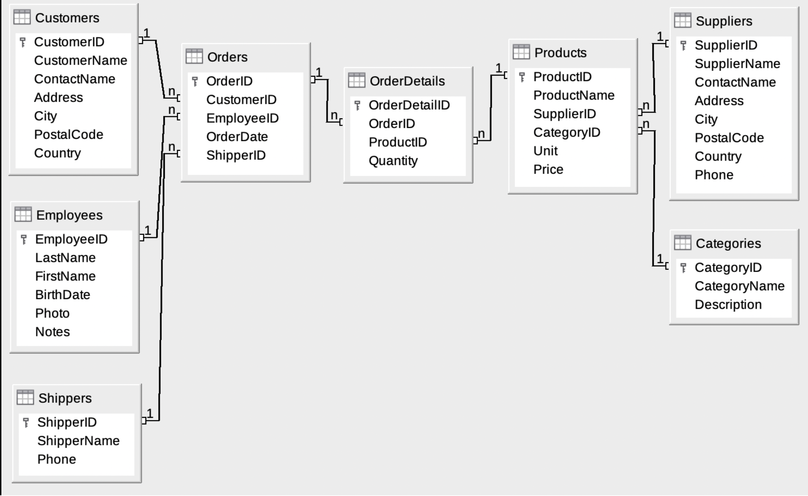

# Curso Básico de SQL con la Base de Datos Northwind

Este repositorio contiene el material y los ejercicios del curso básico de SQL que estoy desarrollando para mejorar mis habilidades y enriquecer mi portafolio. La base de datos Northwind se utiliza como ejemplo para practicar diversas consultas SQL y manipulación de datos.

## Contenido del Curso
git 
1. **Introducción a SQL**
   - ¿Qué es SQL?
   - Historia y versiones de SQL
   - Instalación y configuración de un entorno SQL

2. **Exploración de la Base de Datos Northwind**
   - Descripción de las tablas y sus relaciones
   - Esquema de la base de datos

3. **Consultas Básicas**
   - Seleccionar datos (`SELECT`)
   - Filtrar datos (`WHERE`)
   - Ordenar resultados (`ORDER BY`)

4. **Manipulación de Datos**
   - Insertar datos (`INSERT INTO`)
   - Actualizar datos (`UPDATE`)
   - Eliminar datos (`DELETE`)

5. **Funciones de Agregado**
   - Contar registros (`COUNT`)
   - Sumar valores (`SUM`)
   - Calcular promedio (`AVG`)
   - Valores máximos y mínimos (`MAX`, `MIN`)

6. **Agrupación y Filtrado de Grupos**
   - Agrupar datos (`GROUP BY`)
   - Filtrar grupos (`HAVING`)

7. **Uniones (JOINs)**
   - Inner Join
   - Left Join
   - Right Join
   - Full Join

8. **Subconsultas**
   - Subconsultas en `SELECT`
   - Subconsultas en `WHERE`
   - Subconsultas en `FROM`

9. **Creación y Modificación de Tablas**
   - Crear tablas (`CREATE TABLE`)
   - Modificar tablas (`ALTER TABLE`)
   - Eliminar tablas (`DROP TABLE`)
